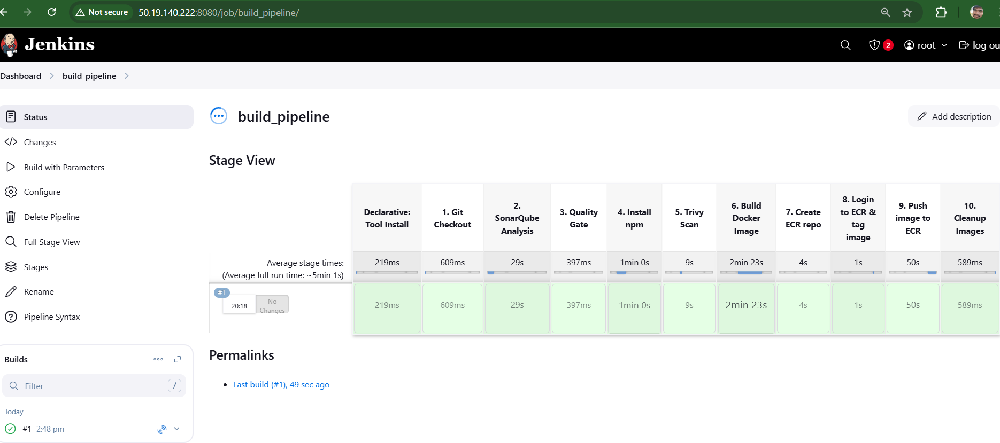
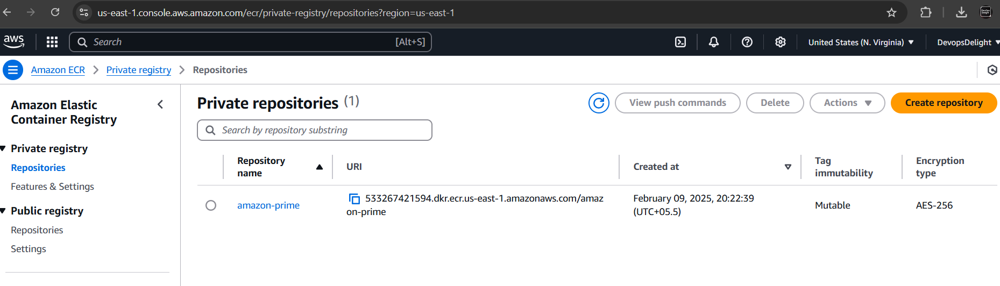
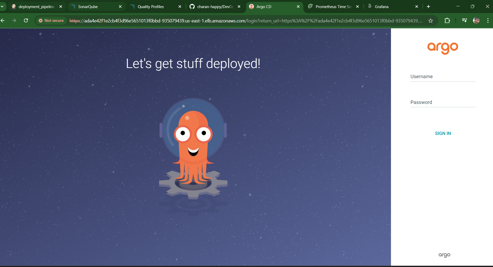
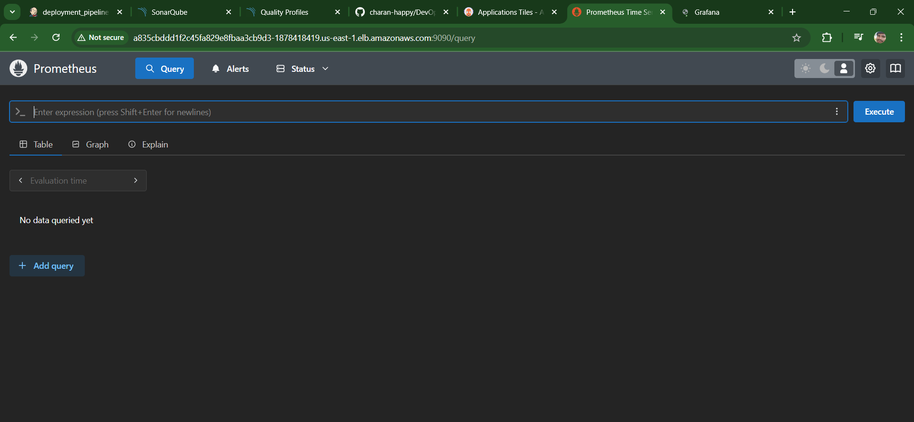
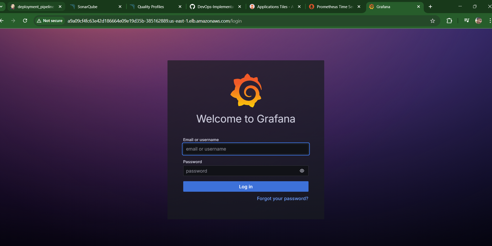
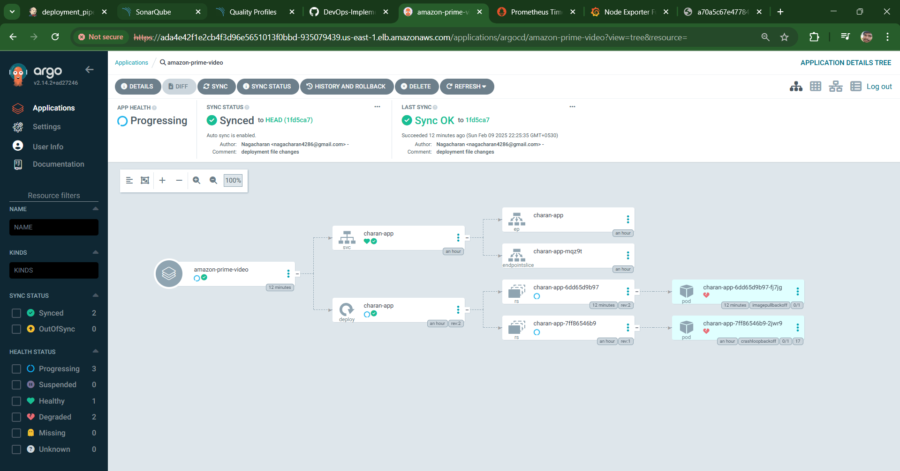

# DevOps-Implementation-Amazon-Prime-Video-Clone

# DevOps-Implementation-Amazon-Prime-Video-Clone


// Project Architecture Diagram

## Project Overview
- By the end of this project, we will learn how to integration set of below mentioned DevOps tools for a video streaming platform like Amazon prime video


Go to your project directory
```
verify npm installation using npm --version 
verify nodejs installation using node --version
npm init -y
you should get package.json file
do npm start 

if you are getting further issues go ahead and troubleshoot

(for me i need to install react-script)
npm install react-scriptsn
npm start
```

- Terraform: Infrastructure as Code (IaC) tool to create AWS infrastructure such as - EC2 instances and EKS clusters.
- GitHub: Source code management.
- Jenkins: CI/CD automation tool.
- SonarQube: Code quality analysis and quality gate tool.
- NPM: Build tool for NodeJS.
- Aqua Trivy: Security vulnerability scanner.
- Docker: Containerization tool to create images.
- AWS ECR: Repository to store Docker images.
- AWS EKS: Container management platform.
- ArgoCD: Continuous deployment tool.
- Prometheus & Grafana: Monitoring and alerting tools.


sonarqube -latest
docker -latest
nodejs -16.20.0
jdk -17.0.8.1+1

## Pre-requisites

1. **AWS Account**: Ensure you have an AWS account. [Create an AWS Account](https://docs.aws.amazon.com/accounts/latest/reference/manage-acct-creating.html)
2. **AWS CLI**: Install AWS CLI on your local machine. [AWS CLI Installation Guide](https://docs.aws.amazon.com/cli/latest/userguide/getting-started-install.html)
3. **VS Code (Optional)**: Download and install VS Code as a code editor. [VS Code Download](https://code.visualstudio.com/download)
4. **Install Terraform in Windows**: Download and install Terraform in Windows [Terraform in Windows](https://learn.microsoft.com/en-us/azure/developer/terraform/get-started-windows-bash)

## Configuration
### AWS Setup
1. **IAM User**: Create an IAM user and generate the access and secret keys to configure your machine with AWS.
2. **Key Pair**: Create a key pair named (your choice, i took name of the keypair as key) `key` for accessing your EC2 instances.













